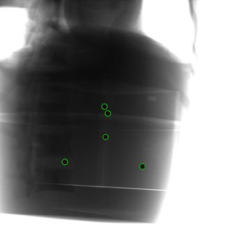

# [CBCT-Calibration](https://github.com/YMZ1998/CBCT-Calibration)
CBCT geometry calibration.

---

CBCT geometry calibration.

This code is based on:

* [CBCTCalibration](https://github.com/neutronimaging/CBCTCalibration)
* [geometric_calibration](https://github.com/mrossi93/geometric_calibration)
* [sharpness_detection_autofocus](https://github.com/russwong89/sharpness_detection_autofocus)

---

## Related Projects

* [CBCT-Reconstruction](https://github.com/YMZ1998/CBCT-Reconstruction)
* [Epipolar Consistency Website](https://www5.cs.fau.de/research/software/epipolar-consistency)
* [Epipolar Consistency Code](https://github.com/aaichert/EpipolarConsistency)

---

## Discussion Threads

* [LEAP Discussions #54](https://github.com/LLNL/LEAP/discussions/54)
* [TIGRE Discussions #539](https://github.com/CERN/TIGRE/discussions/539)

---

## Detected Circles

  

